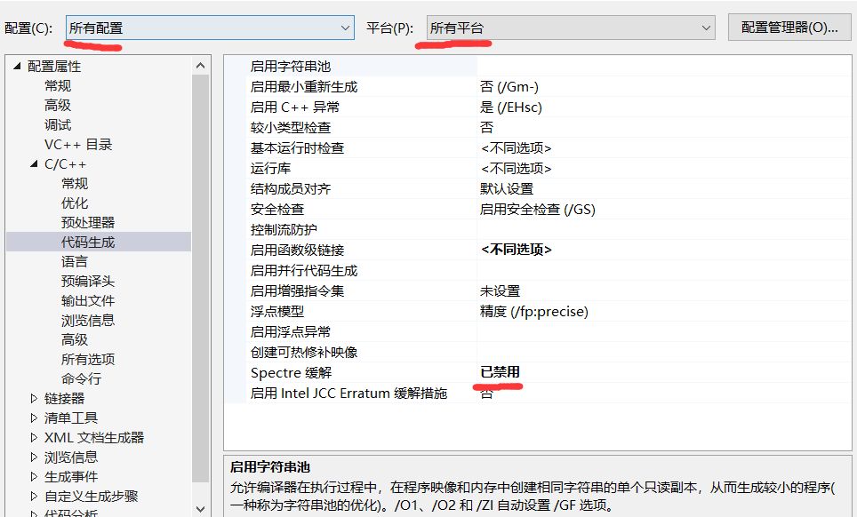

## 安装

妈妈再也不用担心我编译openssl、boost了

官网

https://docs.microsoft.com/en-us/cpp/build/vcpkg?view=vs-2019

https://github.com/microsoft/vcpkg


``` bash
> git clone https://github.com/Microsoft/vcpkg.git
> cd vcpkg

PS> .\bootstrap-vcpkg.bat
Linux:~/$ ./bootstrap-vcpkg.sh
```

根据官网提示，我执行了上面的命令，然后报错了！

<!--more-->

`error MSB8040: Spectre-mitigated libraries are required for this project`

因为我没有安装 `Spectre` 漏洞缓解解决方案，我不想安装

发现可以手动修改项目属性，打开 `vcpkg\toolsrc\vcpkg.sln` 

右键项目属性

配置：所有配置  平台：所有平台

C/C++：代码生成：Spectre 缓解：已禁用



把里面的项目都改一遍，然后保存退出

重新执行

``` bash
PS> .\bootstrap-vcpkg.bat
```

OK，获得 `vcpkg.exe`

``` bash
PS > .\vcpkg.exe search boost
autobahn             18.4.1           WAMP for C++ in Boost/Asio
azmq                 2020-03-03       Boost Asio style bindings for ZeroMQ This library is built on top of ZeroMQ's ...
beast                0                HTTP/1 and WebSocket, header-only using Boost.Asio and C++11
boost                1.72.0           Peer-reviewed portable C++ source libraries
boost[mpi]                            Build with MPI support
boost-accumulators   1.72.0           Boost accumulators module
boost-algorithm      1.72.0           Boost algorithm module
boost-align          1.72.0           Boost align module
boost-any            1.72.0           Boost any module
boost-array          1.72.0           Boost array module
boost-asio           1.72.0           Boost asio module
boost-assert         1.72.0           Boost assert module
boost-assign         1.72.0           Boost assign module
boost-atomic         1.72.0           Boost atomic module
boost-beast          1.72.0           Boost beast module
boost-bimap          1.72.0           Boost bimap module
boost-bind           1.72.0           Boost bind module
boost-build          1.72.0           Boost.Build
boost-callable-tr... 1.72.0           Boost callable_traits module
boost-chrono         1.72.0           Boost chrono module
boost-circular-bu... 1.72.0           Boost circular_buffer module
boost-compatibility  1.72.0           Boost compatibility module
boost-compute        1.72.0           Boost compute module
boost-concept-check  1.72.0           Boost concept_check module
boost-config         1.72.0           Boost config module
boost-container      1.72.0           Boost container module
boost-container-hash 1.72.0           Boost container_hash module
boost-context        1.72.0           Boost context module
boost-contract       1.72.0           Boost contract module
boost-conversion     1.72.0           Boost conversion module
boost-convert        1.72.0           Boost convert module
boost-core           1.72.0           Boost core module
boost-coroutine      1.72.0           Boost coroutine module
boost-coroutine2     1.72.0           Boost coroutine2 module
boost-crc            1.72.0           Boost crc module
boost-date-time      1.72.0           Boost date_time module
boost-detail         1.72.0           Boost detail module
boost-di             1.1.0-1          C++14 Dependency Injection Library.
boost-disjoint-sets  1.72.0           Boost disjoint_sets module
boost-dll            1.72.0           Boost dll module
boost-dynamic-bitset 1.72.0           Boost dynamic_bitset module
boost-endian         1.72.0           Boost endian module
boost-exception      1.72.0           Boost exception module
boost-fiber          1.72.0           Boost fiber module
boost-filesystem     1.72.0           Boost filesystem module
boost-flyweight      1.72.0           Boost flyweight module
boost-foreach        1.72.0           Boost foreach module
boost-format         1.72.0           Boost format module
boost-function       1.72.0           Boost function module
boost-function-types 1.72.0           Boost function_types module
boost-functional     1.72.0           Boost functional module
boost-fusion         1.72.0           Boost fusion module
boost-geometry       1.72.0           Boost geometry module
boost-gil            1.72.0           Boost gil module
boost-graph          1.72.0           Boost graph module
boost-graph-parallel 1.72.0           Boost graph_parallel module
boost-hana           1.72.0           Boost hana module
boost-heap           1.72.0           Boost heap module
boost-histogram      1.72.0           Boost histogram module
boost-hof            1.72.0           Boost hof module
boost-icl            1.72.0           Boost icl module
boost-integer        1.72.0           Boost integer module
boost-interprocess   1.72.0           Boost interprocess module
boost-interval       1.72.0           Boost interval module
boost-intrusive      1.72.0           Boost intrusive module
boost-io             1.72.0           Boost io module
boost-iostreams      1.72.0-1         Boost iostreams module
boost-iterator       1.72.0           Boost iterator module
boost-lambda         1.72.0           Boost lambda module
boost-lexical-cast   1.72.0           Boost lexical_cast module
boost-local-function 1.72.0           Boost local_function module
boost-locale         1.72.0           Boost locale module
boost-locale[icu]                     ICU backend for Boost.Locale
boost-lockfree       1.72.0           Boost lockfree module
boost-log            1.72.0           Boost log module
boost-logic          1.72.0           Boost logic module
boost-math           1.72.0           Boost math module
boost-metaparse      1.72.0           Boost metaparse module
boost-modular-bui... 1.72.0-2
boost-move           1.72.0           Boost move module
boost-mp11           1.72.0           Boost mp11 module
boost-mpi            1.72.0           Boost mpi module
boost-mpl            1.72.0           Boost mpl module
boost-msm            1.72.0           Boost msm module
boost-multi-array    1.72.0           Boost multi_array module
boost-multi-index    1.72.0           Boost multi_index module
boost-multiprecision 1.72.0           Boost multiprecision module
boost-numeric-con... 1.72.0           Boost numeric_conversion module
boost-odeint         1.72.0           Boost odeint module
boost-optional       1.72.0           Boost optional module
boost-outcome        1.72.0           Boost outcome module
boost-parameter      1.72.0           Boost parameter module
boost-parameter-p... 1.72.0           Boost parameter_python module
boost-phoenix        1.72.0           Boost phoenix module
boost-poly-collec... 1.72.0           Boost poly_collection module
boost-polygon        1.72.0           Boost polygon module
boost-pool           1.72.0           Boost pool module
boost-predef         1.72.0           Boost predef module
boost-preprocessor   1.72.0           Boost preprocessor module
boost-process        1.72.0-1         Boost process module
boost-program-opt... 1.72.0           Boost program_options module
boost-property-map   1.72.0           Boost property_map module
boost-property-tree  1.72.0           Boost property_tree module
boost-proto          1.72.0           Boost proto module
boost-ptr-container  1.72.0           Boost ptr_container module
boost-python         1.72.0-1         Boost python module
boost-qvm            1.72.0           Boost qvm module
boost-random         1.72.0           Boost random module
boost-range          1.72.0           Boost range module
boost-ratio          1.72.0           Boost ratio module
boost-rational       1.72.0           Boost rational module
boost-regex          1.72.0           Boost regex module
boost-regex[icu]                      ICU backend for Boost.Regex
boost-safe-numerics  1.72.0           Boost safe_numerics module
boost-scope-exit     1.72.0           Boost scope_exit module
boost-serialization  1.72.0           Boost serialization module
boost-signals        1.68.0-1         Boost signals module
boost-signals2       1.72.0           Boost signals2 module
boost-smart-ptr      1.72.0           Boost smart_ptr module
boost-sort           1.72.0           Boost sort module
boost-spirit         1.72.0           Boost spirit module
boost-stacktrace     1.72.0           Boost stacktrace module
boost-statechart     1.72.0           Boost statechart module
boost-static-assert  1.72.0           Boost static_assert module
boost-system         1.72.0           Boost system module
boost-test           1.72.0           Boost test module
boost-thread         1.72.0           Boost thread module
boost-throw-excep... 1.72.0           Boost throw_exception module
boost-timer          1.72.0           Boost timer module
boost-tokenizer      1.72.0           Boost tokenizer module
boost-tti            1.72.0           Boost tti module
boost-tuple          1.72.0           Boost tuple module
boost-type-erasure   1.72.0           Boost type_erasure module
boost-type-index     1.72.0           Boost type_index module
boost-type-traits    1.72.0           Boost type_traits module
boost-typeof         1.72.0           Boost typeof module
boost-ublas          1.72.0           Boost ublas module
boost-units          1.72.0           Boost units module
boost-unordered      1.72.0           Boost unordered module
boost-utility        1.72.0           Boost utility module
boost-uuid           1.72.0           Boost uuid module
boost-variant        1.72.0           Boost variant module
boost-variant2       1.72.0           Boost variant2 module
boost-vcpkg-helpers  7                a set of vcpkg-internal scripts used to modularize boost
boost-vmd            1.72.0           Boost vmd module
boost-wave           1.72.0           Boost wave module
boost-winapi         1.72.0           Boost winapi module
boost-xpressive      1.72.0           Boost xpressive module
boost-yap            1.72.0           Boost yap module
json-spirit          4.1.0-1          json parser using boost library
libodb-boost         2.4.0-3          Description: Boost support for the ODB ORM library
mongo-cxx-driver[boost]               Use Boost C++17 polyfill. The only option under MSVC.
mqtt-cpp             7.0.1-2          Header-only MQTT client/server for C++14 based on Boost.Asio.
outcome              2.1              Provides very lightweight outcome<T> and result<T> (non-Boost edition)
soci[boost]                           Integration with Boost
spirit-po            1.1.2-1          A header-only C++ library for localization using GNU gettext po files, based o...
trompeloeil          36               A thread-safe header-only mocking framework for C++11/14 using the Boost Softw...

If your library is not listed, please open an issue at and/or consider making a pull request:
    https://github.com/Microsoft/vcpkg/issues

```
Nice!

安装个 `boost-timer` 试一试

``` bash
PS > .\vcpkg.exe install boost-timer
```

注意，如果你在天朝，执行可能会失败

https://github.com/microsoft/vcpkg/issues/11040

已经有小伙伴弄了一个天朝版的了

我选择使用代理

``` bash
PS > set http_proxy=http://127.0.0.1:1080
PS > set https_proxy=http://127.0.0.1:1080
```

然后重新安装，又失败了，提示`安装英文语言包`

继续执行

``` bash
PS > .\vcpkg.exe install boost-timer
```

OK，唉嘿嘿，起飞~

## 使用

Then, to hook up user-wide integration, run (note: requires admin on first use)

``` bash
PS> .\vcpkg integrate install
Linux:~/$ ./vcpkg integrate install
```

官方推荐使用全局引用

如果你不想用这种可以移除

``` bash
PS > .\vcpkg integrate remove
```

其他方式官方也都给出来了

https://github.com/microsoft/vcpkg/blob/master/docs/users/integration.md

我使用 `NuGet`

``` bash
PS > .\vcpkg integrate project
```

会在 `\scripts\buildsystems` 目录下，生成nuget配置文件

打开Visual Studio，点击菜单“工具->NuGet包管理器->程序包管理器设置”，进入设置界面，点击“程序包源”。


点击“加号”增加一个源。修改源的名字为vcpkg。在“源”的选项中点击右侧的”…”选择vcpkg目录下的“scripts\buildsystems”目录，然后点击右侧的“更新按钮”。

点击“确定”，关闭设置对话框。

到此，全局性的设置已经完成，以后不必再重复设置了。

用Visual Studio 打开一个工程或解决方案。右键点击需要设置的工程，选择“管理NuGet程序包”。在右上角的“程序包源”中选择刚刚设置的“vcpkg”。这样在“浏览”选项卡中就可以看到“vcpkg.E.Repos.vcpkg”。点击最右侧的“安装”。这样就可以集成到某个工程了。


OK，跑一下Boost timer的官方例子

``` c++
//  auto_cpu_timer_example.cpp  ------------------------------------------------------//

//  Copyright Beman Dawes 2006

//  Distributed under the Boost Software License, Version 1.0.
//  See http://www.boost.org/LICENSE_1_0.txt

#include <boost/timer/timer.hpp>
#include <cmath>

int main()
{
  boost::timer::auto_cpu_timer t;

  for ( long i = 0; i < 100000000; ++i )
    std::sqrt( 123.456L );  // burn some time

  return 0;
}

```


注意：这里只安装了 `x86-windows` 架构版本

``` text
boost-timer:x86-windows                            1.72.0           Boost timer module
```
执行下面命令，可以查看支持的架构
``` bash
PS > ./vcpkg help triplet
Available architecture triplets
VCPKG built-in triplets:
  arm-uwp
  arm64-windows
  x64-linux
  x64-osx
  x64-uwp
  x64-windows-static
  x64-windows
  x86-windows

VCPKG community triplets:
  arm-ios
  arm-mingw
  arm-windows
  arm64-ios
  arm64-mingw
  arm64-uwp
  x64-ios
  x64-mingw
  x64-osx-dynamic
  x64-windows-static-md
  x86-ios
  x86-mingw
  x86-uwp
  x86-windows-static-md
  x86-windows-static
```

参考: [https://blog.csdn.net/cjmqas/article/details/79282847](https://blog.csdn.net/cjmqas/article/details/79282847)
